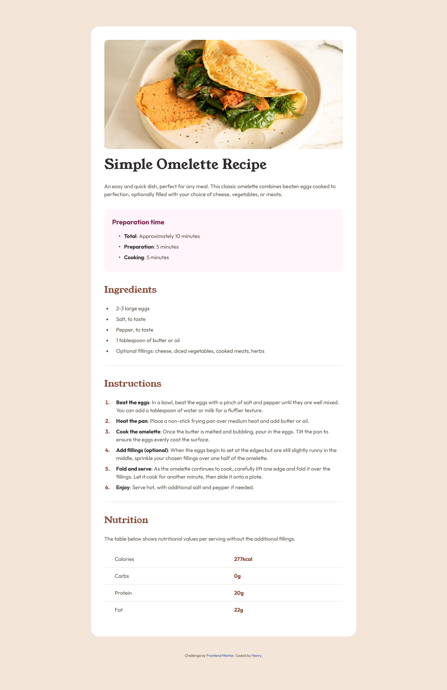

# Frontend Mentor - Recipe page solution

This is a solution to the [Recipe page challenge on Frontend Mentor](https://www.frontendmentor.io/challenges/recipe-page-KiTsR8QQKm). 

## Table of contents

- [Overview](#overview)
  - [The challenge](#the-challenge)
  - [Screenshot](#screenshot)
  - [Links](#links)
- [My process](#my-process)
  - [Built with](#built-with)
  - [What I learned](#what-i-learned)
  - [Continued development](#continued-development)  
- [Author](#author)

## Overview

### Screenshot



### Links

- Solution URL: [https://github.com/Henrydevlab/recipe-page](https://github.com/Henrydevlab/recipe-page)
- Live Site URL: [https://henrydevlab.github.io/recipe-page/](https://henrydevlab.github.io/recipe-page/)

## My process

### Built with

- Semantic HTML5 markup
- CSS custom properties
- CSS Grid
- Mobile-first workflow

### What I learned

This project focused heavily on refining layout and spacing to perfectly match the design, particularly ensuring responsiveness and visual consistency between sections.

Key learnings and areas of refinement include:

1.  **CSS Custom Properties:** Implemented a full color and typography palette using CSS variables (`:root`), which significantly improved maintainability when making styling adjustments.
2.  **Responsive Nutrition Table:** Used **CSS Grid (`display: grid; grid-template-columns: 1fr 1fr;`)** on the `tr` elements to create a tight, two-column layout. We adjusted the alignment (`text-align: left;`) and padding on the data cells (`td`) to pull the nutritional values closer to the labels, preventing the spread-out look on small screens.
3.  **Spacing and Consistency:** Fine-tuned the vertical spacing between all major sections (Ingredients, Instructions, Nutrition) by managing padding and margin conflicts to ensure a consistent gap throughout the page.
4.  **Visual Flow:** Added consistent horizontal separator lines (`border-bottom`) below both the **Ingredients** and **Instructions** sections for improved visual segmentation and consistency.

To highlight the refined CSS Grid implementation for the nutrition table:

```css
/* Mobile Nutrition Table Layout (Tightened) */
.nutrition-table tr {
  display: grid;
  grid-template-columns: 1fr 1fr; /* Equal split for balance */
  padding: 0.75rem 0;
  border-bottom: 1px solid var(--color-stone-150);
}

.nutrition-table td:first-child { 
  padding-left: 2rem; /* Indent the label */
}

.nutrition-table td:last-child { 
  text-align: left; /* Align value to the left of its column (closer to the label) */
  padding-left: 2rem; /* Spacing between columns */
}
```
### Continued development

I want to continue focusing on advanced CSS techniques for micro-layout adjustments, particularly:

- Refining spacing using gap utilities and margin collapsing principles to achieve pixel-perfect consistency across different browsers.

- Exploring logical properties (e.g., margin-inline-start) for better language-agnostic styling.

## Author

- Frontend Mentor - [@henrydevlab](https://www.frontendmentor.io/profile/henrydevlab)
- Twitter - [@henrydevlab](https://www.x.com/henrydevlab)